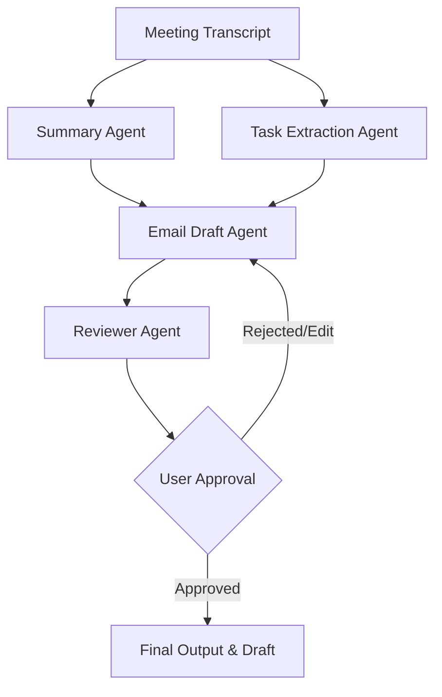

# MeetingMind AI - Agent Guidelines & Project Standards

This document defines the agent architecture, coding standards, and design principles for **MeetingMind AI**, a lightweight multi-agent application built for the Kaggle AI Agents Capstone.

---

## 1. Project Overview & Architecture
MeetingMind AI is a Streamlit-based web application that leverages the Google Agent Development Kit (ADK) and Gemini models to process meeting transcripts and generate structured follow-up summaries, task extractions, and draft emails.

### Agent Workflow

### The Four AI Agents
1. **Summary Agent**: Analyzes transcripts and produces concise, structured meeting summaries highlighting key decisions and context.
2. **Task Extraction Agent**: Extracts action items, assignees, and deadlines from the transcript.
3. **Email Draft Agent**: Combines the outputs of the Summary and Task Extraction Agents to draft a comprehensive follow-up email.
4. **Reviewer Agent**: Critiques and refines the draft email against quality checklist standards (e.g., tone, completeness, formatting).

---

## 2. Core Principles & Coding Standards

### Spec-Driven Development
- Define clear interfaces, schemas, and specifications before writing implementation code.
- Agent prompts and outputs must adhere to structured schemas (e.g., Pydantic models).

### Google ADK (Agent Development Kit) & Gemini
- Use the official Google ADK to instantiate and coordinate agents.
- Leverage Gemini (`gemini-2.5-flash` or newer) as the core LLM driver.
- Store the API key securely via the `GEMINI_API_KEY` environment variable.

### Reusable Agent Skills
- Encapsulate distinct tools and capabilities (e.g., filesystem access, text processing) into modular, reusable Agent Skills.
- Follow the custom skill structure format (`SKILL.md`, supporting python scripts).

### Filesystem MCP Server Integration
- Any filesystem interaction (reading transcript files, writing draft outputs) must route through the local Filesystem MCP server tool interfaces where applicable.

### Humans-in-the-Loop & External Actions
- **CRITICAL**: Never automatically perform external actions (such as sending emails or committing directory alterations) without explicit human approval.
- The UI must display a clear "Approve & Copy" or "Approve & Export" step.

---

## 3. Implementation Guidelines

### Python Coding Standards (PEP 8)
- Keep functions small, single-purpose, and highly readable.
- Follow PEP 8 style guidelines.
- Use explicit typing (`typing` module) for function signatures.
- Write docstrings for all modules, classes, and public functions (Google Style Docstrings).

### Logging & Error Handling
- Use Python's built-in `logging` module to log agent execution phases, token usage estimates, and tool invocation status.
- Implement robust exception handling around LLM API calls and MCP tool operations.

### Testing Recommendations
- **Unit Tests**: Write unit tests for agent utilities, schemas, and prompt templates using `pytest`.
- **Mocking**: Mock Gemini API responses and MCP tool calls in test suites to prevent network dependencies and API cost.
- **Integration Tests**: Verify the end-to-end multi-agent orchestration pipeline with sample meeting transcripts.

### Security Guidelines
- **API Keys**: Never hardcode API keys or credentials. Use `.env` files (git-ignored) or environment variables.
- **File Access**: Limit the Filesystem MCP scope strictly to the project directory to prevent path traversal or unwanted write operations.
- **Output Sanitization**: Ensure generated agent outputs are clean and do not execute raw HTML/JS in the Streamlit UI.
